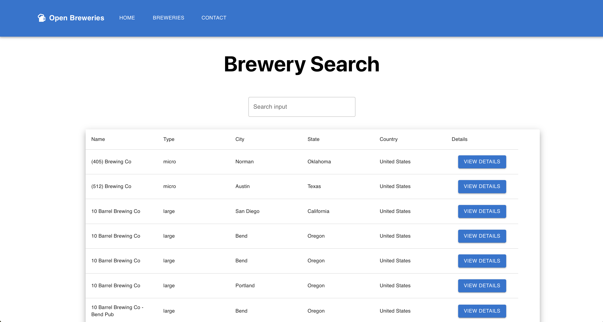
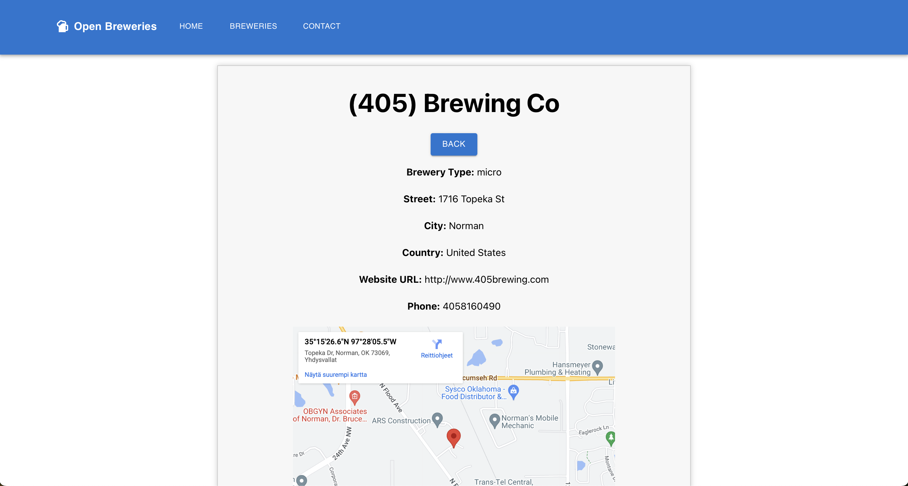

# Breweries App

## DEMO Link (Deployed Application)
[https://vermillion-palmier-29859a.netlify.app/](https://vermillion-palmier-29859a.netlify.app/)

## Screenshots

|  |  |

## Requirements
Fetch, display, and search for brewery companies from the given API endpoint, using React and TypeScript

I have fulfilled these requirements:

- [x] 1. Check the documentation at [https://www.openbrewerydb.org/documentation](https://www.openbrewerydb.org/documentation) Fetch and display information of all the companies.

- [x] 2. Have proper display and routing that user can switch to/back from specific company's detailed page

- [x] 3. Create search component to enable user to input text and search for companies by name.

- [x] 4. Use MaterialUI to make your design more appealing and responsive

- [x] 5. Deploy your application and rewrite README file

## Optional

- [x] 6. Implement performance optimization where applicable: The optimization may not be thoroughly performed
- [x] 7. Use the queries listed in the documentation to sort and limit the returned data and build pagination feature.

- [x] 8. Create a contact form so that user can send question along with their contact information.

- [ ] 9. Use Google-login option to pre-fill the contact form for user (no need to send form data anywhere, just need to fill the form. Submit button can just alert user of successful submission).
